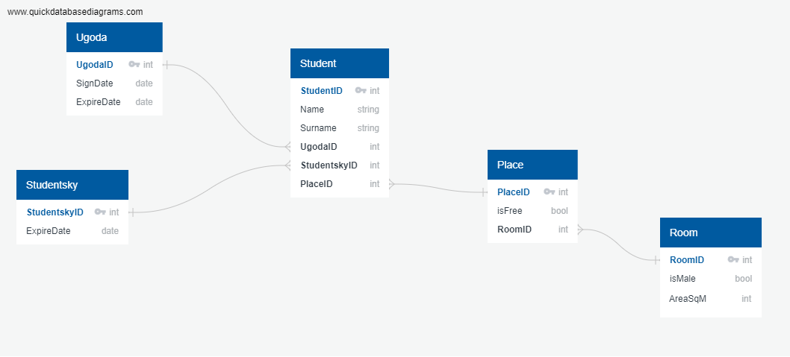

### Система менеджменту гуртожитку

Система призначена для управління гуртожитком. Її основними ***цілями*** є надання можливості адміністрації гуртожитку керувати розселенням студентів у гортожитку:

- [x] мати інформацію про загруженість (кількість місць всього, вільні/зайняті місця); 
- [x] інформація про наповненість кімнати (доступність місця, людей, що проживають в кімнаті); 
- [x] мати відомості про мешканців гуртожитку (студентський квиток, угода, підписана мешканцем).

> Система призначена виключно для використання адміністрацією гуртожитку, мешканці не матимуть доступу до неї.

Система, в цілому, ділиться на два блоки: студент та його дані та дані про гуртожиток (кімнати, ліжко-місця).



#### Основні функції програми

> Що стосуються кімнат:
- [x] внесення в систему відомостей про наявні кімнати: її номер, чоловіча/жіноча, площа;
- [x] система обраховує оптимальну кількість місць в кімнаті та додає їх в систему як незайняті (розрахунок 4м2/чол);
- [x] можливість отримання даних про кімнату, зокрема, її номер, чоловіча/жіноча, площа, кількість вільних місць, мешканців;
- [x] можливість отримати дані про вільні місця (окремо жіночі/чоловічі).


> Що стосуються мешканців:
- [x] внесення в систему відомостей про студента: ім’я, прізвище, студентський;
- [x] присвоєння студенту вільного місця в гуртожитку;
- [x] внесення даних про угоду з мешканцем (дата початку і закінчення дії), можливість видалити прострочену угоду, якщо з мешканцем заключена інша.

## Demonstration

This demo part is about how to use this app in general.

go to client directory
```
cd client
```

first you need to login or register
```
$ ./dorm.py register --username <username> --password <password>

Register successfully
```

then you can login
```
$ ./dorm.py login --username <username> --password <password>

Login successfully
```

get dorm stats, it is public info so students can choose room and place
```
$ ./dorm.py get_dorm_stats

{
    "TotalPlacesAmount": 2,
    "FreeMalePlaces": [
        {
            "PlaceId": 1,
            "IsMale": true,
            "IsFree": true,
            "RoomNumber": "318"
        },
        {
            "PlaceId": 2,
            "IsMale": true,
            "IsFree": true,
            "RoomNumber": "318"
        }
    ],
    "FreeFemalePlaces": null,
    "OccupiedMalePlaces": null,
    "OccupiedFemalePlaces": null
}
```

ask admin to register as student to be able to settle
```
$ ./dorm.py ask_register --name Mykhailo --surname Didur --is_male --ticket_number 'AB 9740 BA' --ticket_expire_date 2025-11-12

Ask register successfully
```

list requests (**important!!! as admin**)
```
$ ./dorm.py ask_actions

{
    "Id": 1,
    "Action": "register",
    "Name": "Mykhailo",
    "Surname": "Didur",
    "IsMale": true,
    "StudentTicketNumber": "AB 9740 BA",
    "StudentTicketExpireDate": "2025-11-12T00:00:00Z",
    "RoomNumber": ""
}
```

approve request (**important!!! as admin**)
```
$ ./dorm.py resolve --action_id 1 --is_approve

Action resolved
```

list students (**important!!! as admin**)
```
$ ./dorm.py students

[
    {
        "Id": 1,
        "Name": "Mykhailo",
        "Surname": "Didur",
        "IsMale": true,
        "Place": {
            "PlaceId": 0,
            "IsMale": false,
            "IsFree": false,
            "RoomNumber": ""
        },
        "Contract": {
            "Id": 0,
            "SignDate": "0001-01-01T00:00:00Z",
            "ExpireDate": "0001-01-01T00:00:00Z"
        },
        "StudentTicket": {
            "Id": 1,
            "SerialNumber": "AB 9740 BA",
            "ExpireDate": "2025-11-12T00:00:00Z"
        }
    }
]
```

all the other commands you can find in help
```
$ ./dorm.py --help

usage: dorm.py [-h] [-u USERNAME] [-p PASSWORD] [--name NAME] [--surname SURNAME] [--is_male] [--ticket_number TICKET_NUMBER] [--ticket_expire_date TICKET_EXPIRE_DATE]
               [--room_number ROOM_NUMBER] [--action_id ACTION_ID] [--is_approved] [--area_sqm AREA_SQM]
               cmd

Dormitory Management System

positional arguments:
  cmd                   subcommand to execute

options:
  -h, --help            show this help message and exit
  -u USERNAME, --username USERNAME
                        username
  -p PASSWORD, --password PASSWORD
                        password
  --name NAME           name
  --surname SURNAME     surname
  --is_male             is male
  --ticket_number TICKET_NUMBER
                        ticket number
  --ticket_expire_date TICKET_EXPIRE_DATE
                        ticket expire date, format=YYYY-MM-DD
  --room_number ROOM_NUMBER
                        room number
  --action_id ACTION_ID
                        action id
  --is_approved         is approved action
  --area_sqm AREA_SQM   area sqm
```